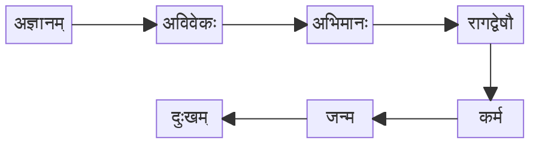
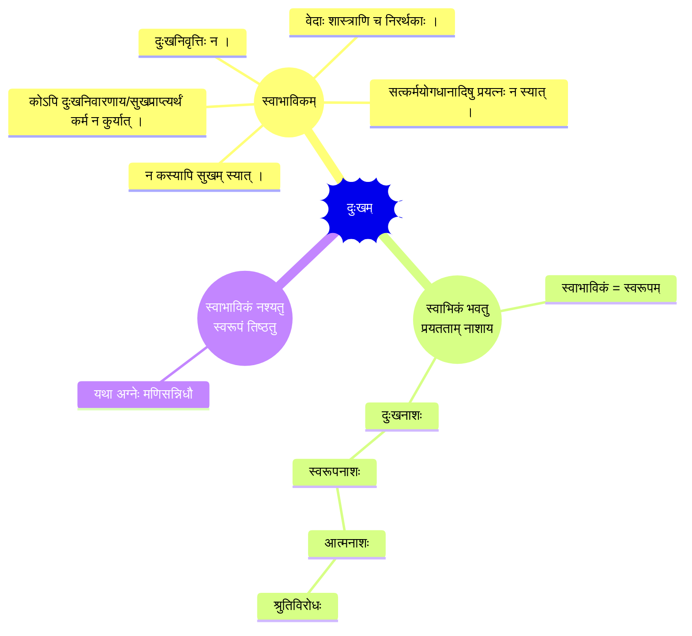

---
config:
    theme: base
---
## दु:खम्

इदानीमस्य जीवस्य दुःखं च जन्म च कर्म च रागद्वेषादि चाभिमानश्चाविवेकश्चाज्ञानं चेत्येतेषु पूर्वपूर्व प्रत्युतरोत्तरं हेतुः ।
तत्र दुःखादिचतुष्टयं चतुर्थपञ्चमवर्णकयोर्विचार्यते ॥

जीवात्मनो दुःखं स्वाभाविकं वा आगन्तुकं वेति चेत्, आगन्तुकमिति ज्ञेयम् । स्वाभाविकमिति चेदनेकदोषाः सन्ति।
तत्कथमिति चेत् । अस्य जीवात्मनो दुःखं स्वाभाविकं चेद्दुःखनिवृत्तिः कदाचिदपि न स्यात्, सुखमपि कस्यापि न स्यात्,
दुःखनिवृत्त्यै सुखमाप्त्यै च कस्यापि कर्म न स्यात्, सत्कर्मयोगध्यानोपासनेषु कस्यापि प्रयत्नो न स्यात्, वेदशास्त्रपुराणानि
च व्यर्थानि स्युरिति जानीहि ।

**ननु दुःखं स्वाभाविकमस्तु** तन्निवृत्त्यै च प्रयत्नं करोत्विति चेत्, कदाचिदप्येतन्न सम्भवति,
स्वाभाविकस्य स्वस्वरूपत्वात् । स्वस्वरूपनाशार्थं को वा प्रयत्नं कुर्यात्? स्वस्वरूपनाशे सति पुरुषार्थभाक्कः स्यात्?
स्वाभाविकमेव स्वस्वरूपं कथमिति चेत् । गुडस्य मधुरगुणः स्वभावः । तस्य मधुरगुणस्य नाशे भवितव्ये गुडस्यैव नाशो
भवेत् । तथा जीवात्मनो दुःखं स्वाभाविकं चेद्दुःखनाशे भवितव्य आत्मस्वरूपनाश एव स्यात् । आत्मनो नाशो नास्ति ।
अविनाशी नित्य इति च `अविनाशी वा अरेऽयमात्मा` (बृ० ४.५.१४) `आकाशवत्सर्वगतश्च नित्यः`, `न जायते
म्रियते वा विपश्चिनायं कुतश्चिन्न बभूव कश्चित् । अजो नित्यः शाश्वतोऽयं पुराणो न हन्यते हन्यमाने शरीरे ॥`
(कठ० २.१८) इत्यादिश्रुतयो वदन्ति । तस्मादात्मनो दुःखं स्वाभाविकं न भवति, किं त्वागन्तुकमेवेति जानीहि ।

**ननु स्वाभाविकं नश्यतु स्वरूपं तिष्ठत्विति** चेत्, तन्न सम्भवति । नन्वग्नेः स्वाभाविकमुष्णत्वं मणिमन्त्रादिभिर्गच्छति, स्वरूपनाशोऽपि
नास्ति, अन्यच्छैत्यमप्यागच्छति, तथाऽऽत्मनोऽपि दुःखं स्वाभाविकं भवतु, तदुत्कृष्टकर्मोपासनयोगबलेन गच्छतु, सुखं चागच्छत्विति
वदसि चेत् । सा निवृत्तिस्तात्कालिक्येव नात्यन्तिकी । कथमिति चेत् । कर्मजन्यं सकलमपि कर्मनाशे नश्यति ।
त्वदुक्तदृष्टान्तदार्ष्टन्तिकयोरग्न्यात्मनोरुष्णत्वं दुःखित्वं च मणिमन्त्रादिभिरुत्कृष्टकर्मोपासनयोगैश्च गतमपि मण्याद्यपनये कर्मादिक्षये
च शैत्यं च सुखं च गच्छेत्, पुनः स्वाभाविकमुष्णत्वं दुःखित्वं चागच्छेत् । एवं च सति सर्वजीवानां तात्कालिकमुक्तिं विना
पुनजन्मरहिता मुक्तिर्न स्यात् । किं च मोक्षस्य जन्यत्वे अनित्यत्वमपि स्यात् । `न च पुनरावर्तते` इति मुक्तेर्नित्यत्वप्रतिपादकश्रुतेः
`अखण्डमानन्दमरूपमद्भुतम्` इति श्रुतेश्च विरोधः स्यात् । आत्मनो दुःखस्वभावत्वे सुषुप्त्यवस्थायां तूष्णींभावे योगिनां समाधौ
च दुःखमेव प्रतीयेत । तथा न दृश्यते । किं तु त्रयाणामपि व्युत्थानानन्तरम् `एतावत्पर्यन्तं सुखमेवाहमासम्` इति सुखमेव
स्मर्यते । तस्मादात्मनः सुखमेव स्वाभाविकं दुःखमागन्तुकमिति जानीहि ॥

सुखस्वरूपस्याप्यात्मनो **दुःखं शरीरपरिग्रहेणागतम्** 'यत्र यत्र शरीरपरिग्रहस्तत्र तत्र दुःखम्' इति व्याप्तेः ।
ननु लोके राजादीनामपि शरीरपरिग्रहेण दुःखमस्ति वेति चेत्; अस्त्येव तेषामपि शत्रुपीडया राज्यभारेण धनधान्यक्षयेण
स्त्रीपुत्रादिमरणेन जरादिना स्वमरणेन च दुःखदर्शनात् । लोके 'केचित्सुखेन वर्तन्ते' इति व्यवहारो वृथा मोह एव ।
मोहेनापि दुःखस्य सुखत्वव्यवहारः कथमिति चेत् । भारवाहको बहुयोजनदूरं कार्यार्थं त्वरया धावन्, तथा संततमपि
कृष्यादिकर्मकरणशीलश्वेत्येवमादयः सर्वेऽपि स्वस्वकर्मणो दुःखरूपत्वेऽपि मोहेन तचत्कर्म सुखं मत्वा संतुष्टा गानं कुर्वन्त
उत्साहवन्तश्च वर्तन्ते । तस्मान्मोहेन दुःखमेव सुखमिव भातीति ज्ञातव्यम् ॥

तर्हि विवेकिनामपि शरीरपरिग्रहाद्दुःखमस्ति वेति चेत्, तेषामपि क्षुत्पिपासादिना शीतोष्णादिना व्याधिना सर्पवृश्चिकव्याघ्रादिना
च दुःखमस्त्येव । तर्हि विवेक्यविवेकिनो को विशेष इति चेत्, तयोर्बाह्यव्यापारेण विशेषाभावेऽप्यान्तरव्यापारेण विशेषोऽस्ति ।
यो विवेकी स महात्मा `सकलमपि दुःखमन्तःकरणस्यैव नात्मनः, सच्चिदानन्दस्वरूपस्यात्मनोऽनृतजडदुःखस्वरूपान्तःकरणधर्मैरणुमात्रमपि
सम्बन्धो नास्ति` इति श्रुतियुक्त्यनुभवैर्विचार्य ज्ञात्वा तिष्ठति । तथा हि `असङ्गो ह्ययं पुरुषः` (बृ० ४.३.१५) इति श्रुतिः,
निरवयवत्वात्सत्यत्वादित्यादिका युक्तयः, सुषुप्तितूष्णींभावसमाधिष्वनुभवश्च वेदितव्याः । योऽविवेकी स दुरात्मा त्वात्मस्वरूपमविचार्य
देहादिकमेवात्मानं मत्वाऽनात्मधर्मानात्मन्यारोप्याऽऽत्मधर्माश्च सच्चिदानन्दाननात्मन्यारोप्यैवमन्योन्याभ्यासं कुर्वन् `अहं देवः`
`अहं मनुष्यः` `अहमान्ध्रः` `अहं द्राविडः` `अहं ब्राह्मणः` `अहं क्षत्रियः` `अहं वैश्य` `अहं शूद्रः`
`अहं ब्रह्मचारी` `अहं गृहस्थः` `अहं वानप्रस्थः` `अहं संन्यासी` इत्यादिप्रकारेण जातिवर्णाश्रमाभिमानी तिष्ठति ।
एवं विवेक्यविवेकिनोर्बहु भेदोऽस्ति । विचार्यमाणे तयोर्बाह्यव्यापारेणापि न साम्यम् । कथमिति चेत् । विवेकी प्रपञ्चं
सर्वमपि मिथ्येति निश्चित्य प्रारब्धभोगमपि स्वप्नभोगतुल्यमेव पश्यति । अविवेकी तु प्रपञ्चः सत्यः, आत्मनः
सुखदुःखानुभवोऽपि सत्य एवेति पश्यति । एवं विवेकिनामपि शरीरपरिग्रहवशाद्दुःखमस्त्येव ॥

देवानामपि 'वज्रहस्तः पुरंदरः' इत्यादिवेदवचनेषु शरीरपरिग्रहदर्शनादुःखमस्त्येव । कथमिति चेत् । अन्योन्यं युद्धतः
कोपशापाभ्यामसुरराक्षसोपद्रवात्पुण्यकर्मफलनाशे सति भाव्यधःपातभयादपि दुःखमस्त्येव । कथं दुःखिनामपि तेषामितरैरुपास्यत्वं
कथं वा सुखदातृत्वमिति चेत्, अस्मिल्लोके राजप्रभृतीनां दुःखिनामपि स्वाश्रितपरिपालनादिकं यथा तथेति ज्ञेयम् ।
'देवलोके देवा आनन्दरूपास्तिष्ठन्ति' इति श्रुतेर्देवा दुःखं सर्वमप्यन्तःकरणधर्मं मत्वाऽऽत्मानन्दस्वरूपं सदाऽनुभवन्त एव
तिष्ठन्तीति तात्पर्यम् । तेषामपि दुःखमस्तीति वदन्त्याः 'ता एता देवताः सृष्टा अस्मिन्महत्यर्णवे प्रापतन्' (ऐ० २.१)
इति श्रुतेर्देवानामपि शरीरपरिग्रहाद्दुःखमस्त्येवेति तात्पर्यम्। तस्माद्विदेहमुक्त्यर्थमेव प्रयत्नः कर्तव्यः ॥

नन्वशरीरमुक्तेरेव मुक्तित्वं चेत्सशरीरा आकाशे नक्षत्ररूपेण परिदृश्यमानाः केचन देवा मुक्ता इति मनुष्यैः
कथं कथ्यन्त इति चेत्, शृणु। सालोक्यं सामीप्यं सारूप्यं सायुज्यमिति **चतुर्विधा मुक्तिः** । चर्या क्रिया
योगो ज्ञानमिति चतुर्णां क्रमेण साधनानि । भगवत्कैंकर्यरूपदासभावश्चर्या । शिवविष्ण्वादिपूजाविधिः क्रिया ।
यमनियमाद्यष्टाङ्गयोगो योगः । जीवपरमेश्वरयोरैक्यसाक्षात्कारो ज्ञानम् । तत्राद्यास्तिस्रो मुक्तयो मुख्या न भवन्ति,
पुनरावृत्तिसम्भवात् । सायुज्यमेव मुख्या मुक्ति, पुनरावृत्तिवर्जनात् । 'योगेन सायुज्यम्' इति शास्त्रं
निर्गुणब्रह्मयोगविषयम् । सशरीरमुक्तानामिवाशरीरमुक्तानां कदाचिदपि कुत्रचिदपि केनापि कथंचिदपि
दर्शनाभावाच्छून्यमेवाशरीरमुक्तिरिति न मन्तव्यम् । अशरीरमुक्तानां शरीरस्यैव शून्यत्वं न स्वरूपसुखस्य ।
स्वरूपसुखं तु सुषुप्तिसुखवदशरीरत्वात्स्वसंवेद्यमेव नान्यसंवेद्यम् । सुषुप्तिर्मुक्तिसमाना चेत्सापि मुक्तिः
स्यादिति न वाच्यम् । सुखानुभवमात्रेण साम्येऽपि सुषुप्तावज्ञानं पुनरुत्थानं चास्ति । मुक्तौ तदुभयमपि
नास्ति । अतः सुषुप्तेर्मुक्तित्वं न सम्भवति । अत एव प्रलयस्यापि न मुक्तित्वम् । एवं सुषुप्तिसुखवन्मुक्तिसुखस्य
स्वानुभवगम्यत्वात्प्रत्यक्षत्वमेव, न शून्यत्वम् । तर्हि सशरीरमुक्तीनामिवाशरीरमुक्तेरपि प्रत्यक्षत्वे तत्र को भेद इति
चेत्, अज्ञाननिवृत्तिः पुनरुत्थानाभावश्च भेद इत्युक्तम् । एवं श्रुतियुक्तिभ्यामशरीरमुक्तेः परमसुखत्वं शरीरपरिग्रहेण
दुःखं चोक्तम् । इदानीमनुभवेनापि तदुभयं वदामः । नित्यं सुषुप्तौ शरीरपरिग्रहाभावाद्दुःखाभावश्व जाग्रत्स्वप्नयोः
शरीरपरिग्रहेण दुःखं च सर्वैरनुभूयते ! तस्मात् `यत्र यत्र शरीरपरिग्रहस्तत्र तत्र दुःखम्` इति व्याप्तेरानन्दस्वरूपस्याप्यात्मनः
शरीरपरिग्रहादेव दुःखमागच्छति, न तु स्वतः । तस्य शरीरस्य को वा हेतुरिति चेत्पूर्वकर्मसहितपञ्चीकृतभूतान्येव न
केवलभूतानि तेषां सर्वत्र वर्तमानत्वात्तेभ्यः शरीरं स्यादिति न वक्तव्यम् ॥

ननु शुक्लशोणितरूपेण परिणतानामेव भूतानां शरीरकारणत्वेन विवक्षितत्वात्तादृशान्येव शरीरस्य कारणमिति न वक्तव्यम्,
व्यर्थशुक्लशोणितेषु शरीरोत्पन्यदर्शनात् । तस्मात्कर्मसहितान्येव शरीरस्य कारणानि । पञ्चभूतानां देशकालादीनां च
सर्वसाधारणत्वात्तत्तत्कर्मवैचित्र्यमेव शरीरवैचित्र्यहेतुः, यथा मृदादीनां साधारणत्वेऽपि कुलालव्यापारवैचित्र्यमेव
घटादिकार्यवैचित्र्यहेतुः । यथा दृष्टान्ते घटादेर्मृदुपादानकारणं कुलालव्यापारो निमित्तकारणम्, एवं दार्ष्टान्तिकेऽपि
शरीरस्य पञ्चीकृतभूतान्युपादानकारणं तत्तत्कर्म निमित्तकारणम् । तस्माद्भोगप्रदकर्मणि सति शरीरपरिग्रहः, यथा
जाग्रत्स्वप्नयोः कर्मणो विद्यमानत्वाच्छरीरप्राप्तिः । कर्माभावे शरीराभावः, यथा सुषुप्तौ कर्माभावाच्छरीराभावः ।
किं च यथा मृदि सत्यामपि कुलालव्यापाराभावे घटोत्पत्त्यभावः, तथेश्वरसृष्टेषु पञ्चभूतेषु सत्स्वप्यात्मज्ञानेन
कर्मसु नष्टेषु तस्य ज्ञानिनः शरीरं नोत्पद्यते ॥

ननु कर्मशास्त्रे `अवश्यमनुभोक्तव्यं कृतं कर्म शुभाशुभम् । नाभुक्तं क्षीयते कर्म कल्पकोटिशतैरपि ॥` इति,
ज्ञानशास्त्रे `ज्ञानाग्निः सर्वकर्माणि भस्मसात्कुरुते तथा` (गी० ४ ३७) इति च वचनयोः परस्परं विरोधे कथं
निर्णयः कर्तव्य इति चेत्, शृणु । शास्त्रे प्रबलवचनं दुर्बलवचनं चास्ति । प्रबलं सिद्धान्तवचनम् । दुर्बलं
पूर्वपक्षवचनम् । प्रबलं दुर्बलं निरस्यति । तद्यथा `अहिंसा परमो धर्मः` इति वचनं प्रबलमपि सत्
`यागे पशुवधः कर्तव्यः` इत्यतिप्रबलवचनेन निरस्यते, एवम् `अवश्यमनुभोक्तव्यम-` इति वचनम्
`तपसा किल्बिषं हन्ति` (मनु० १२.१०४) इति प्रबलवचनेन दुर्बलं सन्निरस्यते । तस्मात्सञ्चितेषु कर्मसु
बहुषु सत्स्वप्यात्मज्ञानेन तानि नश्यन्त्येव । कर्माभावे जन्माभावः । जन्माभावे दुःखाभावः । दुःखाभावे आनन्दाविर्भाव
इत्ययमेव सिद्धान्तः ॥

इति चतुर्थवर्णकम् ॥

<notes>

    
दुःखहेतुः

* दुःखम्
    * हेतुः – अज्ञानम् ⇒ अविवेकः ⇒ अभिमानः ⇒ रागद्वेषौ ⇒ दुःखम् ⇒ जन्म ⇒ कर्म
    * स्वाभाविकम्?  
      `आगन्तुकं हि वस्तु निराक्रियते न स्वरूपम् ।`
        * दुःखनिवृत्तिः न ।
        * न कस्यापि सुखम् स्यात् ।
        * कोऽपि दुःखनिवारणाय/सुखप्राप्त्यर्थं कर्म न कुर्यात् ।
        * सत्कर्मयोगधानादिषु प्रयत्नः न स्यात् ।
        * वेदाः शास्त्राणि च निरर्थकानि ।
    * दुःखं स्वाभाविकं, प्रयतताम् नाशाय
        * स्वाभाविकं = स्वरूपम्
        * दुःखनाशः ⇒ स्वरूपनाशः ⇒ आत्मनाशः (श्रुतिविरोधः)
    * स्वाभाविकं नश्यतु, स्वरूपं तिष्ठतु
        * यथा अग्निः मणिसन्निधौ ।
        * कर्मजन्यं कर्मनाशे नश्यति । सुखं यदि आगन्तुकं (कर्मजन्यं) –
            * सुखनाशे दुःखनिवर्तनम् (आत्यन्तदुःखनाशः न)
            * सुखम् अनित्यं भवेत् ⇒ पुनर्जन्मरहिता मुक्तिः न भवेत् (श्रुतिविरोधः)
            * मोक्षः जन्यः (न सिद्धः/नित्यः), अतः अनित्यत्वं स्यात् ।
            * सुषुप्तौ/समाधौ/तूष्णींभावे दुःखमेव प्रतीयेत यतः प्रयत्नाभावः (अनुभवविरुद्धम्)
    * शरीरपरिग्रहः (कारणम्)  
      `यत्र यत्र शरीरपरिग्रहस्तत्र तत्र दुःखम्`
        * मोहेन शरीरिणः दुःखमेव सुखमिव भाति ।
        * विवेकी vs अविवेकी (दुःखं तु द्वयोरस्त्येव
            * आन्तरव्यापारः
                * विवेकी – सकलमपि दुःखमन्तःकरणस्यैव नात्मनः (असङ्गो ह्ययं पुरुषः) ।
                * अविवेकी – देहादिकमेवात्मानं मनुते (अहं देवः, अहं मनुष्यः, ...)
            * बाह्यव्यापारः निर्विशेषः इव
                * विवेकी – जगन्मिथ्या, प्रारब्धभोगः स्वप्नतुल्यः ।
                * अविवेकी – प्रपञ्चः सत्यः, आत्मनः सुखदुःखानुभवोऽपि सत्यः ।
        * देवानामपि दुःखमस्त्येव (शरीरपरिग्रहत्वात्)
        * तर्हि मुक्तिः = अशरीरत्वम्?
            * चतुर्धा 
                * सालोक्यं (भगवत्कैंकर्यरूपदासभावश्चर्यया)
                * सामीप्यं (शिवविष्ण्वादिपूजाविधिरूपक्रियया)
                * सारूप्यं (यमनियमाद्यष्टाङ्गयोगेन)
                * **सायुज्यम्** (जीवपरमेश्वरयोरैक्यसाक्षात्काररूपज्ञानेन) । पुनरावृत्तिवर्जनम् ।
            * सुषुप्तिः (यथा प्रलयः) (≠ मोक्षः)
                * अज्ञानम्
                * पुनरुत्थानम्
            * सुषुप्तिसुखवन्मुक्तिसुखस्य स्वानुभवगम्यत्वात्प्रत्यक्षत्वमेव, न शून्यत्वम् ।
            * विदेहमुक्तः vs जीवन्मुक्तः
                * अज्ञाननिवृत्तिः पुनरुत्थानाभावश्च भेद इत्युक्तम् ।
                * शरीरमुक्तेः परमसुखत्वं शरीरपरिग्रहेण दुःखं चोक्तम् ।
        * शरीरकारणम्
            * कर्म + पञ्चीकृतभूतानि
                * कर्म एव शरीरवैचित्र्यकारणम् (निमित्तकारणम्) ।
                    * ज्ञाने जाते कर्माणि नश्यन्ति, अतः पुनरावृत्तिः न जायते (कर्मसहितानां भूतानामेव शरीरावाप्तिः)।
                        * कर्माणि कथं नश्यन्ति? (श्रुतिविरोधः)
                            * प्रबलवचनं (सिद्धान्तवचनम्), दुर्बलवचनम् । प्रबलं दुर्बलं निरस्यति ।
                * भूतानि (उपादानकारणम्) ।
                * कर्माभावः ⇒ जन्माभावः ⇒ दुःखाभावः ⇒ आनन्दविर्भावः ।
            * शुक्लशोणितरूपेण परिणतानि भूतानि?
                * न, व्यर्थतत्वात् । (न सर्वेषां परिणतिः)
            

?? अशरीरमुक्तानां शरीरस्यैव शून्यत्वं न स्वरूपसुखस्य । स्वरूपसुखं तु सुषुप्तिसुखवदशरीरत्वात्स्वसंवेद्यमेव नान्यसंवेद्यम् ।
?? तर्हि सशरीरमुक्तीनामिवाशरीरमुक्तेरपि प्रत्यक्षत्वे तत्र को भेद इति चेत्, अज्ञाननिवृत्तिः पुनरुत्थानाभावश्च भेद इत्युक्तम् ।
* अत्र अज्ञाननिवृत्तिः कथं सशरीरमुक्तानां न स्यात् ?
?? एवं सुषुप्तिसुखवन्मुक्तिसुखस्य स्वानुभवगम्यत्वात्प्रत्यक्षत्वमेव, न शून्यत्वम् ।

=> अपञ्चीकृतभूतानि न व्यवहारयोग्यानि ।

दुःखं स्वाभाविकं वा आगन्तुम् वा?
स्वाभिविकं = ??
आगन्तुकं = ?? आगन्तुकं हि वस्तु निराक्रियते न स्वरूपम् ।

स्वाभाविकं चेत् 

दुःखं स्वाभाविकं, तथापि प्रयत्नः

* स्वाभाविकं = स्वरूपम्
* दुःखनाशः ⇒ स्वरूपनाशः ⇒ आत्मनाशः (श्रुतिविरोधः)

स्वाभाविकं नश्यतु, स्वरूपं तिष्ठतु

* यथा अग्निः मणिसन्निधौ ।
* कर्मजन्यं कर्मनाशे नश्यति । सुखं यदि आगन्तुकं (कर्मजन्यं)

आगन्तुकं 

</notes>

