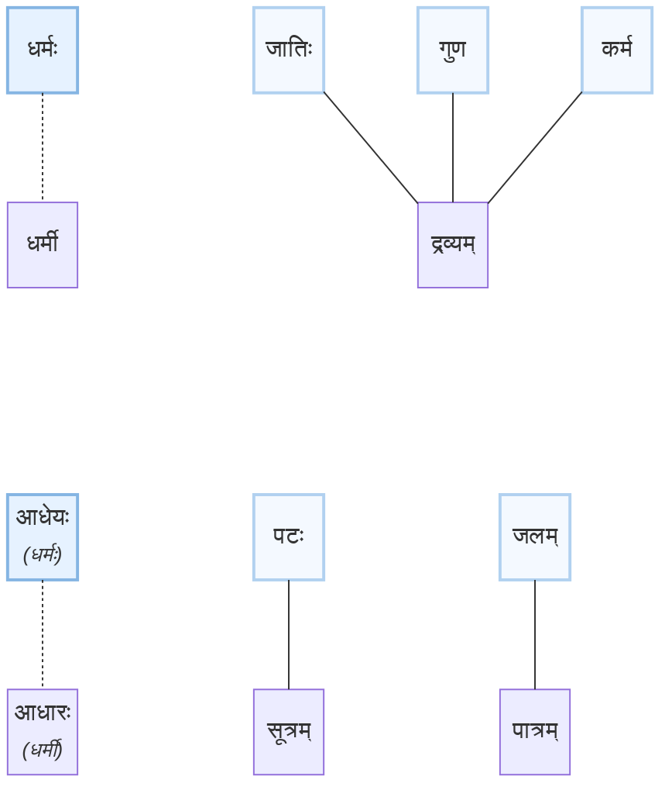

धर्मः ध्रियते तिष्ठति वर्तते यः स धर्मः। आकाशादिकं विना सर्व एवं पदार्थाः यत्र कुत्रचिदपि वर्तन्त इति सर्व एव धर्मा इत्युच्यन्ते। यत्र यः वर्तते स तस्य धर्मः। यथा द्रव्ये जातिगुणकर्माणि तिष्ठन्तीति जातिगुणकर्माणि द्रव्यस्य धर्माः। सूत्रादौ अवयवे पटादि अवयविद्रव्यं तिष्ठति इति द्रव्यम् अपि पटादि सूत्रादेः धर्मः। पात्रे जलं वर्तते इति पात्रस्य धर्मः जलम्। आकाशादिकं तु न कुत्र अपि वर्तते इति आकाश न कस्य अपि धर्मः। अत एव आकाशम् अवृत्तिपदार्थ इति उच्चते ॥१॥

    
चित्रम्

---
