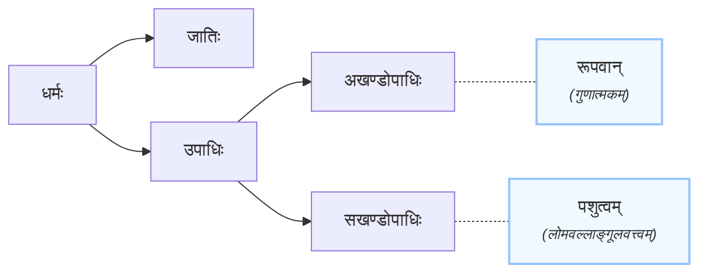

उपाधिरपि पुनः सखण्डोपाधिरखण्डोपाधिश्चेति द्विविधः। खण्डेन (अंशेन) सह वर्तते इति सखण्डः। यश्च
अंशतो विभक्तुं शक्यते स सखण्डोपाधिधर्म इति यावत्। यथा पशुत्वम्। तद्धि लोमवल्लाङ्गूलवत्त्वम्। ततश्च
तस्य लोमलाङ्गूलादय अंशः बहवो वर्तन्त इति द्रव्यरूपं पशुत्वं धर्मः सखण्डोपाधिः। एवं रूपवानयम् इत्यत्र
गुणात्मकं रूपं धर्मः। स च सखण्डोपाधिः। रूपत्वजात्याश्रयो हि रूपम्। ततश्च रूपस्य रूपत्वजाति
आश्रयश्चेति अंशद्वयमस्ति ॥३॥

---

